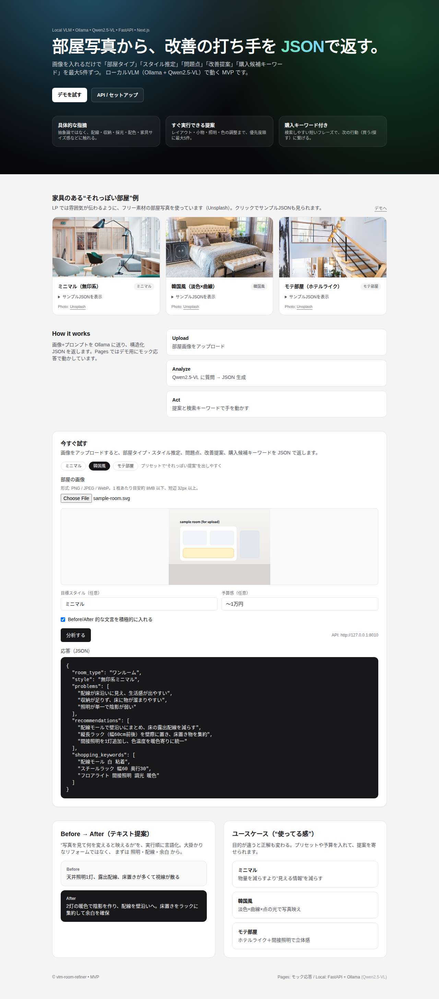

# vlm-room-refiner

**部屋の写真 → 課題・改善案・買い物キーワードを JSON で返す**、**100% ローカル**のインテリア支援ツールです。  
画像は基本あなたのマシンと [Ollama](https://ollama.com/) 上の VLM だけを通ります（クラウドの画像解析 API に送らない）。

[](https://github.com/rsasaki0109/vlm-room-refiner/actions/workflows/ci.yml)
[](LICENSE)
[](https://github.com/rsasaki0109/vlm-room-refiner/stargazers)



| [Live Demo (GitHub Pages)](https://rsasaki0109.github.io/vlm-room-refiner/) | UI とモック JSON（バックエンドなし） |
| --- | --- |

---

## こんな人向け

- **プライバシー重視**: 部屋写真を外部 API に送りたくない
- **ローカル AI**: Ollama + Qwen-VL でオフラインに近い運用がしたい
- **アプリ連携したい**: FastAPI で `/analyze` に投げれば JSON が返るので、拡張しやすい

## 特徴

| | |
| --- | --- |
| **構造化出力** | `room_type` / `style` / `problems` / `recommendations` / `shopping_keywords` を [Pydantic](backend/schema.py) でスキーマ固定 |
| **賃貸寄りの前提** | プロンプト側で「工事・開口増設・塗り壁し直し」などを抑え、置き型・配線モール・照明などに寄せる（完全ではないので [dogfooding](notes/dogfooding/README.md) で育てる想定） |
| **Web + API + CLI** | Next.js の LP／デモ、FastAPI、`backend/cli.py` |
| **CI** | フロント `build` とバックエンド `pytest`（[workflow](.github/workflows/ci.yml)） |

## 返す JSON（例）

```json
{
  "room_type": "ワンルーム",
  "style": "無印系ミニマル",
  "problems": ["…"],
  "recommendations": ["…"],
  "shopping_keywords": ["…"]
}
```

## 必要な環境

- [Ollama](https://ollama.com/)（推論）— 例: **Qwen3-VL**（`qwen3-vl:8b`）または **Qwen2.5-VL**（`qwen2.5vl:7b`）
- **Node.js** 20+ と **npm**
- **Python 3.12+**

## クイックスタート

### 1. モデルを取得（未導入なら）

```bash
ollama pull qwen3-vl:8b
# メモリが厳しければ: qwen3-vl:4b など
# 互換: ollama pull qwen2.5vl:7b
```

### 2. 依存インストール

```bash
git clone https://github.com/rsasaki0109/vlm-room-refiner.git
cd vlm-room-refiner
npm install
cd frontend && npm install && cd ..
```

```bash
cd backend
python3 -m venv .venv
source .venv/bin/activate   # Windows: .venv\Scripts\activate
pip install -r requirements.txt
cd ..
```

### 3. 起動（Ollama を動かした状態で）

リポジトリ**ルート**から:

```bash
npm run dev
```

- **API**: `http://127.0.0.1:8010`（`API_PORT` で変更可）
- **Web**: `http://localhost:3000`
- API の向き先を変える場合は `frontend/.env.local`（`frontend/.env.local.example` をコピー）

### 4. 動作確認

```bash
curl -sS http://127.0.0.1:8010/health
# {"status":"ok"}

curl -sS -F "file=@/path/to/room.jpg" http://127.0.0.1:8010/analyze | jq .
```

（`jq` が無ければ末尾の `| jq .` を外してください）

## よくあるつまずき

| 症状 | 対処 |
| --- | --- |
| **503** | `ollama serve` が動いているか、`OLLAMA_HOST` が正しいか |
| **502** | 画像が極端に小さい等でモデル側が失敗することがある |
| **400** | 短辺 32px 未満の画像は弾く（VLM 制約回避） |
| **413** | 既定 8MB 超。`MAX_IMAGE_BYTES` で調整 |

## 環境変数（API / 推論）

| 変数 | 既定 | 意味 |
| --- | --- | --- |
| `OLLAMA_HOST` | `http://127.0.0.1:11434` | Ollama のベース URL |
| `OLLAMA_MODEL` | `qwen3-vl:8b` | `ollama list` のタグ名に合わせる |
| `OLLAMA_FALLBACK_MODEL` | `qwen2.5vl:7b` | Qwen3-VL が JSON を破ったときの 1 回だけのフォールバック |
| `OLLAMA_TIMEOUT_SECONDS` | `600` | 推論タイムアウト（秒） |
| `MAX_IMAGE_BYTES` | `8388608`（8MB） | 超過は HTTP 413 |
| `CORS_ORIGINS` | ローカル 3000 系 | カンマ区切りで追記可 |
| `API_PORT` | `8010` | `scripts/run-api.sh` / ルート `npm run dev` |

## API

| メソッド | パス | 説明 |
| --- | --- | --- |
| `GET` | `/health` | 生存確認 |
| `POST` | `/analyze` | `multipart/form-data` の `file`（画像）＋任意 `style` / `budget` / `before_after` |

## CLI

```bash
cd backend
source .venv/bin/activate
python cli.py /path/to/room.jpg --style ミニマル
```

## テスト

```bash
cd backend
./run-tests.sh
```

ROS 等でグローバル `pytest` プラグインが衝突する場合は `PYTEST_DISABLE_PLUGIN_AUTOLOAD=1` を使う（スクリプト内で設定済み）。

## スクショ更新（Playwright）

```bash
npm install
cd frontend && npm install && cd ..
npm run screenshot
```

`docs/assets/screenshot.png` が更新されます（API・Ollama 不要）。

## Dogfooding（プロンプト検証）

ペルソナ × 複数画像でバッチ実行する場合は [notes/dogfooding/README.md](notes/dogfooding/README.md) を参照。

```bash
npm run dogfood
```

## CI（GitHub Actions）

`main` / `master` のプッシュと PR でフロント `build` とバックエンド `pytest` が Ubuntu 上で実行されます（Ollama は不要）。

## リポジトリ構成

```text
vlm-room-refiner/
  package.json              # npm run dev / screenshot / dogfood
  backend/                  # FastAPI, Ollama, CLI, tests
  frontend/                 # Next.js 15（App Router）
  docs/                     # architecture, prompts, experiments
  scripts/                  # run-api.sh, verify-ollama.sh, gen_dogfood_synthetic_images.py
  notes/dogfooding/         # バッチ結果メモ（実写真パスはコミットしない運用）
```

## ドキュメント

| ファイル | 内容 |
| --- | --- |
| [docs/architecture.md](docs/architecture.md) | 構成 |
| [docs/prompts.md](docs/prompts.md) | プロンプトの考え方 |
| [docs/experiments.md](docs/experiments.md) | 実験メモ |

## GitHub で見つけやすくする（おすすめトピック）

リポジトリの **About → Topics** に例えば次を追加すると検索に掛かりやすくなります:

`ollama` · `qwen-vl` · `vision-language-model` · `local-ai` · `privacy` · `fastapi` · `nextjs` · `interior` · `room-design` · `structured-output`

## ロードマップ（案）

- 実写でのプロンプト継続調整と `docs/experiments.md` への記録
- アップロード前の長辺リサイズ・レート制限など本番向けハードニング
- スタイルプリセットと予算帯のより明示的な反映

## コントリビューション

[CONTRIBUTING.md](CONTRIBUTING.md) を参照してください。

## ライセンス

[MIT](LICENSE)
